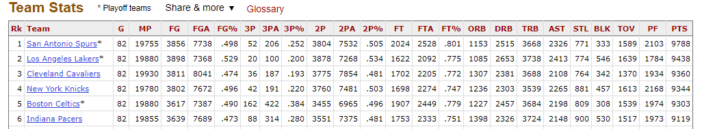
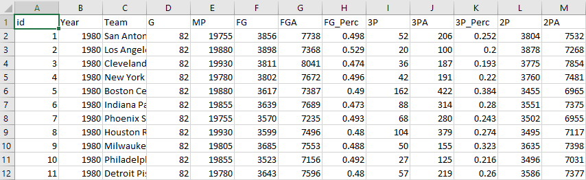
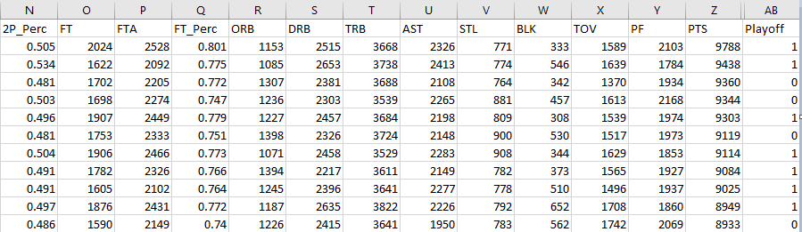
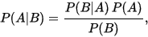
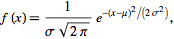
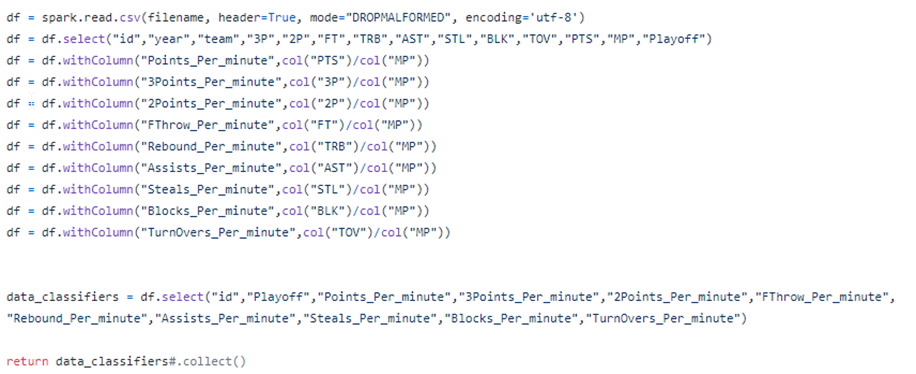

### Course: Big Data Analysis (SOEN 691)

#### Semester: Winter 2020

#### Team ID:  12

## Project: NBA Playoff Prediction


### Table of Contents
1. [Abstract](#Abstract)

2. [Introduction](#Introduction)

3. [Materials and Methods](#Materials_and_Methods)

4. [Results](#Results)

5. [Discussion](#Discussion)

6. [References](#References)

7. [Glossary](#Glossary)

   

<a/>

1. #### Abstract                                                                                  

   Machine learning algorithms with predictive analytics has become a key to fully understand how things work in different fields, and further a key to sustainable developments and improvements. This project presents a comparative study between two supervised learning algorithms (Gaussian Naïve Bayes and Support Vector Machine) in big data, to make predictions based on basketball statistics. This project is going to gather quantitative data of the general statistics of the basketball teams in the regular NBA season. Then based on the quantitative analysis of classifiers studied the algorithms used will predict if a team is going to make it to the playoff or not.

   

2. #### Introduction

   ##### <u>Context</u>

   Prediction of sports events has always been intriguing while challenging as there are many factors that must be considered. According to Forbes.com[1] magazine NBA teams’ value or revenue is in billions of dollars. Which means it can have big merit in predicting which team is performing good and who will make it to the playoffs.  

   ##### <u>Objective</u> 

   The objective of this project is to use SVM and Naïve Bayes algorithms to make early predictions during the regular NBA season and estimate whether a team is performing well and will be advancing to the playoffs. This will be achieved by analyzing the performance and result of different algorithms applied against the classifiers.

   ##### <u>Related Works</u>

   Due to the time constraints we were not able to find exact studies, but we found two research project papers on analysis of predicting NBA game results. 

   1. [Predicting the NBA Playoffs with Machine Learning](https://rstudio-pubs-static.s3.amazonaws.com/190581_5edd87c937f2489c86c1b9b567a62b6e.html) a study made by Matthew Tribby in 2016  to predict who will win in a match between 2 teams. Even though he is using the same [basketball-reference.com](https://www.basketball-reference.com/) reference to gather the data and his dataset our datasets do not have the same classifiers.

   2. [Prediction of NBA games based on Machine Learning Methods](https://homepages.cae.wisc.edu/~ece539/fall13/project/AmorimTorres_rpt.pdf) is another study by Renato Amorim Torres in 2013 where he is again using the same [basketball-reference.com](https://www.basketball-reference.com/) reference to build his data and is trying to predict the outcome of a match but we differ in our choice of classifiers. 

      

3. #### Materials and Methods <a name="Materials_and_Methods"></a>

   ##### <u>Dataset</u>

   The data was gathered manually from [basketball-reference.com/leagues/](https://www.basketball-reference.com/leagues/)  website leagues module. We started from the 1980 NBA season and went up to 2018 season. The data are the teams statistics during the regular season, below is a sample screenshot of the 1980 NBA season.

   

   We created a CSV file of 1074 records a sample of the records and the corresponding fields are shown below

   

   

   

   *At the end of the document the [glossary](#Glossary) explains the name of the fields* 

   ##### <u>Technologies</u> 

   We have decided to use the following technologies:

   - Apache Spark Framework : As per [wikipedia](https://en.wikipedia.org/wiki/Apache_Spark) Apache Spark is an open-source distributed general-purpose cluster-computing framework. Spark provides an interface for programming entire clusters with implicit data parallelism and fault tolerance.
   -  Dataframe API library :  As per [wikipedia](https://en.wikipedia.org/wiki/Apache_Spark) again Apache Spark has as its architectural foundation the Resilient Distributed Dataset (RDD) and The *<u>Dataframe</u>* API was released as an abstraction on top of the RDD
   - SKlearn  (Scikit-learn): As per [wikipedia](https://en.wikipedia.org/wiki/Scikit-learn) is a free software machine learning library for the Python programming language. It features various classification, regression and clustering algorithms including support vector machines, random forests, gradient boosting, k-means and DBSCAN

   ##### <u>Algorithms</u>

   Since we have a small dataset with only 1074 records we have decided to use Gaussian Naïve Bayes & SVM supervised learning models in our study.

   <u>Gaussian Naïve Bayes</u>: The Naïve Bayes classifier aggregates information using **conditional probability** with an assumption of independence among features, based on **Bayes Theorem**:

    using the mean and standard deviation result that was calculated, it becomes possible to estimate the probability of the classifying attribute using the Gaussian function:

   <u>SVM</u>: It focus on generating hyperplanes that segregates the classes in the best way.  **Radial basis function kernel**: The RBF kernel is a popular kernel function commonly used in SVM classification. **RBF can map an input space in infinite dimensional space**.

   

4. #### Results:

   ##### <u>Dataset Analysis</u>

   As we have we were analyzing the dataset at hand we noticed a couple of issues that might skew the results. First the number of teams changed over the years 23, 27, 29 and lately 30. Moreover between seasons 1980 and 1983 twelve teams qualified to the playoffs but as of 1984 season the number was increased to sixteen teams.

   After a close study of the data we noticed that each team plays a certain minutes per season the field name in the data was **MP** *(Minutes Played)* so we deduced that if we used the **MP** field as a divisor for all the quantitative fields that we are choosing as classifier we can resolve the issue by converting the classifiers to ratios.

   ##### <u>Technology Implementation</u>

   - **<u>Data loading and pre-processing</u>**: Using Dataframe API in the Spark Framework we calculated and extracted our classifiers that will be used in the supervised modeling algorithms. As explained before we have used **MP** field to get a  ratio of the field that will be processed; example the **PTS** *(points)*  field below

     ```python
     df.withColumn("Points_Per_minute",col("PTS")/col("MP"))
     ```

     below is a code  data load code snip : 

     The classifiers that were created and used are: *"Playoff" , "Points_Per_minute", "3Points_Per_minute" , "2Points_Per_minute" , "FThrow_Per_minute" , "Rebound_Per_minute", "Assists_Per_minute" , "Steals_Per_minute" , "Blocks_Per_minute" , "TurnOvers_Per_minute"*

     

   - **<u>Split Data using K-fold</u>**: 

   - <u>**Data modeling and classification**</u>:

   - **<u>Performance evaluation</u>**: F1 score, confusion matrix

   ##### <u>Technology Comparison</u>

   

5. #### Discussion

   

6. #### References

   1. [NBA Team Values 2019: Knicks On Top At $4 Billion](https://www.forbes.com/sites/kurtbadenhausen/2019/02/06/nba-team-values-2019-knicks-on-top-at-4-billion/#70067f0ee667)
   2. [Predicting the NBA Playoffs with Machine Learning](https://rstudio-pubs-static.s3.amazonaws.com/190581_5edd87c937f2489c86c1b9b567a62b6e.html)
   3. [Prediction of NBA games based on Machine Learning Methods](https://homepages.cae.wisc.edu/~ece539/fall13/project/AmorimTorres_rpt.pdf) 
   4.  [basketball-reference.com](https://www.basketball-reference.com/)
   5.  [basketball-reference.com/leagues/](https://www.basketball-reference.com/leagues/) 
   6. [Apache Spark wikipedia](https://en.wikipedia.org/wiki/Apache_Spark)
   7. [Sklearn wikipedia](https://en.wikipedia.org/wiki/Scikit-learn)

   

7. #### Glossary

   ```html
    Rk: Rank
    Team: Team
    G: Games
    MP: Minutes Played
    FG: Field Goals
    FGA: Field Goal Attempts
    FG%, FG_Perc: Field Goal Percentage
    3P: 3-Point Field Goals
    3PA: 3-Point Field Goal Attempts
    3P% 3P_Perc: 3-Point Field Goal Percentage
    2P: 2-Point Field Goals
    2PA: 2-point Field Goal Attempts
    2P%, 2p_Perc: 2-Point Field Goal Percentage
    FT: Free Throws
    FTA: Free Throw Attempts
    FT%, FT_Perc: Free Throw Percentage
    ORB: Offensive Rebounds
    DRB: Defensive Rebounds
    TRB: Total Rebounds
    AST: Assists
    STL: Steals
    BLK: Blocks
    TOV: Turnovers
    PF: Personal Fouls
    PTS: Points
   ```


