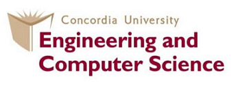

### Course: Big Data Analysis (SOEN 691)

#### Semester: Winter 2020

#### Team ID:  12

## Project: NBA Playoff Prediction

1. #### Abstract                                                                                       

   Machine learning algorithms with predictive analytics has become a key to fully understand how things work in different fields, and further a key to sustainable developments and improvements. This project presents a comparative study between two supervised learning algorithms (Gaussian Naive Bayes and Support Vector Machine) in big data, to make predictions based on basketball statistics. This project is going to gather quantitative data of the general statistics of the basketball teams in the regular NBA season. Then based on the quantitative analysis of classifiers studied the algorithms used will predict if a team is going to make it to the playoff or not.

   

2. #### Introduction

   ##### Context

   Predictions of sports events has always been intriguing while challenging as there are many factors that must be considered. According to Forbes.com magazine NBA teams’ value or revenue is in billions of dollars. Which means it can have big merit in predicting which team is performing good and who will make it to the playoffs.  

   ##### Objective 

   The objective of this project is to use SVM and Naïve Bayes algorithms to make early predictions during the regular whether an NBA team is performing well and will be advancing to the playoffs. Then analyzing the performance and result of different algorithms applied.

   ##### Related Works

   Due to the time constraints we were not able to find exact studies, but we found two research papers on analysis on predicting NBA game results. 

   1. [Predicting the NBA Playoffs with Machine Learning](https://rstudio-pubs-static.s3.amazonaws.com/190581_5edd87c937f2489c86c1b9b567a62b6e.html) a study made by Matthew Tribby in 2016  to predict who will win in a match between 2 teams. Even though he use using the same dataset reference [basketball-reference.com](https://www.basketball-reference.com/) to gather the data our datasets do not have the same classifiers.

   2. [Prediction of NBA games based on Machine Learning Methods](https://homepages.cae.wisc.edu/~ece539/fall13/project/AmorimTorres_rpt.pdf) another study by Renato Amorim Torres in 2013 where again he is using the same dataset reference [basketball-reference.com](https://www.basketball-reference.com/)  he is trying to predict the outcome of a match. 

      

3. #### Materials and Methods

   

4. #### Results

   

5. #### Discussion

#### References

1. [NBA Team Values 2019: Knicks On Top At $4 Billion](https://www.forbes.com/sites/kurtbadenhausen/2019/02/06/nba-team-values-2019-knicks-on-top-at-4-billion/#70067f0ee667)

2. 

   

